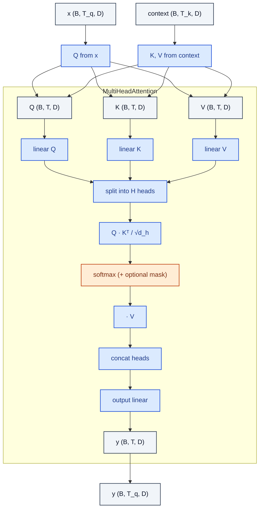

# CrossAttention

> Q comes from x, K and V come from a separate context tensor.

**Shapes:** `x:(B, T_q, D), ctx:(B, T_k, D) → (B, T_q, D)`

```mermaid
flowchart TD
    n0_0["x  (B, T_q, D)"]:::io
    n0_1["context  (B, T_k, D)"]:::io
    n1_0["Q from x"]:::op
    n1_1["K, V from context"]:::op
    subgraph n2_0["MultiHeadAttention"]
        n2_0_0_0["Q  (B, T, D)"]:::io
        n2_0_0_1["K  (B, T, D)"]:::io
        n2_0_0_2["V  (B, T, D)"]:::io
        n2_0_1_0["linear Q"]:::op
        n2_0_1_1["linear K"]:::op
        n2_0_1_2["linear V"]:::op
        n2_0_2_0["split into H heads"]:::op
        n2_0_3_0["Q · Kᵀ / √d_h"]:::op
        n2_0_4_0["softmax (+ optional mask)"]:::act
        n2_0_5_0["· V"]:::op
        n2_0_6_0["concat heads"]:::op
        n2_0_7_0["output linear"]:::op
        n2_0_8_0["y  (B, T, D)"]:::io
        n2_0_0_0 --> n2_0_1_0
        n2_0_0_1 --> n2_0_1_1
        n2_0_0_2 --> n2_0_1_2
        n2_0_1_0 --> n2_0_2_0
        n2_0_1_1 --> n2_0_2_0
        n2_0_1_2 --> n2_0_2_0
        n2_0_2_0 --> n2_0_3_0
        n2_0_3_0 --> n2_0_4_0
        n2_0_4_0 --> n2_0_5_0
        n2_0_5_0 --> n2_0_6_0
        n2_0_6_0 --> n2_0_7_0
        n2_0_7_0 --> n2_0_8_0
    end
    n3_0["y  (B, T_q, D)"]:::io
    n0_0 --> n1_0
    n0_1 --> n1_1
    n1_0 --> n2_0_0_0
    n1_0 --> n2_0_0_1
    n1_0 --> n2_0_0_2
    n1_1 --> n2_0_0_0
    n1_1 --> n2_0_0_1
    n1_1 --> n2_0_0_2
    n2_0_8_0 --> n3_0
    classDef io fill:#f1f5f9,stroke:#334155,stroke-width:1.4px,color:#0f172a
    classDef op fill:#dbeafe,stroke:#1d4ed8,stroke-width:1.4px,color:#1e3a8a
    classDef norm fill:#dcfce7,stroke:#15803d,stroke-width:1.4px,color:#14532d
    classDef act fill:#ffedd5,stroke:#c2410c,stroke-width:1.4px,color:#7c2d12
    classDef attn fill:#ede9fe,stroke:#6d28d9,stroke-width:1.4px,color:#4c1d95
    classDef merge fill:#fef3c7,stroke:#b45309,stroke-width:1.4px,color:#78350f
    classDef emb fill:#fef9c3,stroke:#a16207,stroke-width:1.4px,color:#713f12
    classDef loss fill:#fee2e2,stroke:#b91c1c,stroke-width:1.4px,color:#7f1d1d
    classDef ctrl fill:#f5f5f4,stroke:#52525b,stroke-width:1.4px,color:#27272a
    classDef ref fill:#e0f2fe,stroke:#0369a1,stroke-width:2px,color:#0c4a6e,stroke-dasharray: 4 2
```
