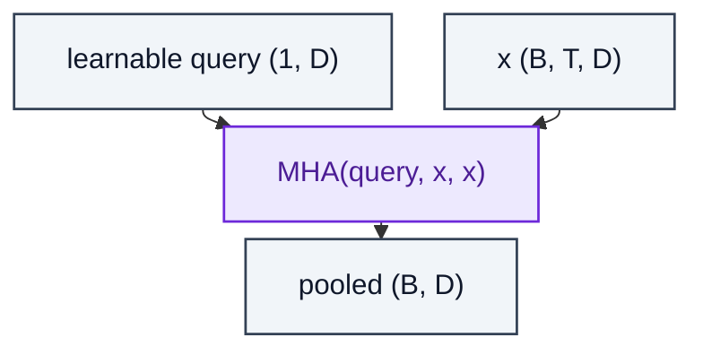

# AttentionPooling

> A learnable query attends over a sequence to produce a single pooled vector.

**Shapes:** `(B, T, D) → (B, D)`

**Used in**

- CLIP text/image projection head (last-token / attention pooling variants)
- Set Transformer / PMA — pooling-by-multihead-attention
- Speech / video classification heads

**Tasks**

- Reducing a variable-length sequence to a single (or k) summary vector
- Replacing mean / max pooling for set-structured inputs

**Common pitfalls**

- Single learnable query is a narrow bottleneck — use k > 1 queries (Set Transformer PMA) for richer summaries.
- Causal masking is rarely needed here, but accidentally inheriting it from a parent model breaks pooling silently.

**See also**

- [Set Transformer (Lee et al. 2018)](https://arxiv.org/abs/1810.00825)
- [CLIP (Radford et al. 2021)](https://arxiv.org/abs/2103.00020)
