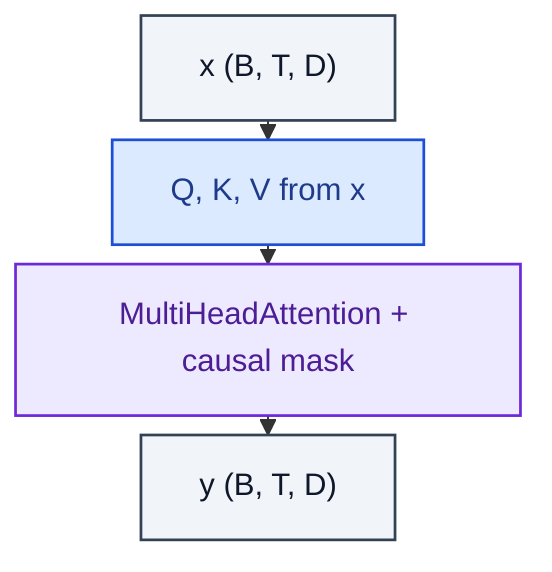

# CausalSelfAttention

> SelfAttention with an upper-triangular mask preventing future leakage.

**Shapes:** `(B, T, D) → (B, T, D)`

**Used in**

- GPT-1/2/3/4, LLaMA, Mistral, Gemma — all decoder-only LLMs
- Decision Transformer and Trajectory Transformer in RL
- Autoregressive image / audio models (ImageGPT, MusicLM)

**Tasks**

- Next-token prediction / language modelling
- Any task where outputs are generated left-to-right

**Common pitfalls**

- Mask must be applied to logits BEFORE softmax (set to −∞), not after.
- Cached K/V at inference must respect the mask — slicing past the current position is a common bug that 'works' but leaks future tokens at evaluation.
- Use `is_causal=True` in PyTorch SDPA to enable FlashAttention's fast path rather than passing an explicit mask tensor (much faster, less memory).

**See also**

- [GPT-2 (Radford et al. 2019)](https://cdn.openai.com/better-language-models/language_models_are_unsupervised_multitask_learners.pdf)
- [GPT-3 (Brown et al. 2020)](https://arxiv.org/abs/2005.14165)
- [Decision Transformer (Chen et al. 2021)](https://arxiv.org/abs/2106.01345)
