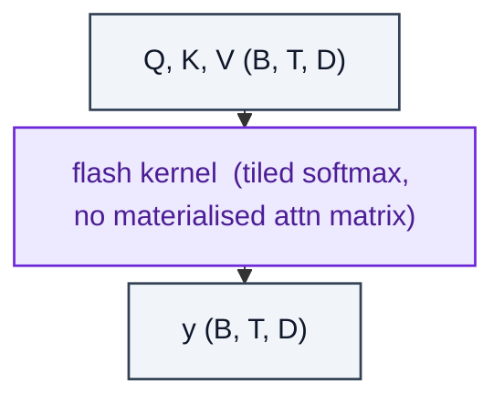

# FlashAttention

> Mathematically identical to MHA, but uses tiled IO-aware kernels.

**Shapes:** `(B, T, D) → (B, T, D)`

**Used in**

- PyTorch 2.x `scaled_dot_product_attention` fast path
- All modern LLM training stacks (Megatron-LM, vLLM, TGI, Triton)
- Mamba's selective-scan kernel and FlashAttention-2 for ViTs

**Tasks**

- Replacing standard MHA in any model with sequence length > ~512 to cut memory and time
- Long-context fine-tuning (32k–128k tokens) that would otherwise OOM

**Common pitfalls**

- Custom attention biases (e.g. ALiBi, T5 relative bias) may NOT be supported on all FlashAttention versions — check the kernel signature.
- FP32 fallback is required for some bias shapes — surprise speed cliff.
- Backward pass recomputes attention — increases compute by ~2× for a memory-bound win.

**See also**

- [FlashAttention (Dao et al. 2022)](https://arxiv.org/abs/2205.14135)
- [FlashAttention-2 (Dao 2023)](https://arxiv.org/abs/2307.08691)
- [FlashAttention-3 (Shah et al. 2024)](https://arxiv.org/abs/2407.08608)
