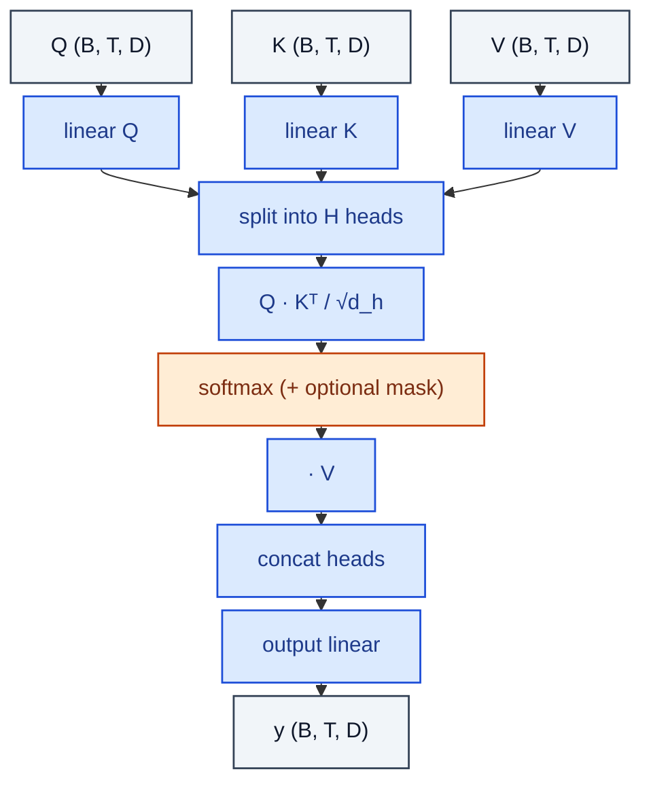

# MultiHeadAttention

> Standard scaled dot-product attention with H heads and an output projection.

**Shapes:** `Q,K,V:(B, T, D) → (B, T, D)`

**Used in**

- Transformer encoder / decoder — the original 'Attention is All You Need'
- BERT, GPT, T5, ViT and every LLM and ViT derivative
- Cross-modal models (CLIP, BLIP-2, Flamingo) for vision–language alignment

**Tasks**

- Modelling long-range dependencies without convolutional locality bias
- Conditioning one sequence on another (cross-attention)
- Set / unordered-input processing where position is encoded explicitly

**Common pitfalls**

- Quadratic memory and compute in sequence length — switch to FlashAttention or sliding-window variants for T > a few thousand.
- Forgetting `1/√d_h` scaling makes the softmax saturate at long heads (poor gradients).
- Mask shape / dtype mismatches silently break causal attention — assert with a unit test.

**See also**

- [Attention Is All You Need (Vaswani et al. 2017)](https://arxiv.org/abs/1706.03762)
- [FlashAttention (Dao et al. 2022)](https://arxiv.org/abs/2205.14135)
- [Multi-Query Attention (Shazeer 2019)](https://arxiv.org/abs/1911.02150)
- [Grouped-Query Attention (Ainslie et al. 2023)](https://arxiv.org/abs/2305.13245)
