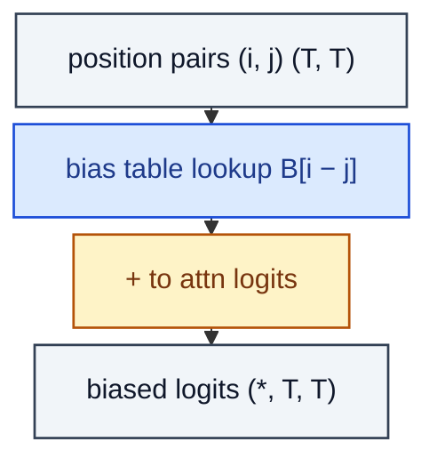

# RelativePositionBias

> Learnable bias added to attention logits as a function of (i − j).

**Shapes:** `logits:(*, T, T) → biased logits`

**Used in**

- T5 (bucketed log-spaced relative positions)
- Swin Transformer (2D relative position bias)
- DeBERTa, ALiBi (linear bias instead of learned table)

**Tasks**

- Position-aware attention without losing translation equivariance
- Extrapolating to lengths beyond training (especially with ALiBi)

**Common pitfalls**

- Naïve table size is O(T²); use log-bucketing or relative-distance clipping for long T.
- Bias shape may be incompatible with FlashAttention — check before adopting.
- Sharing the table across heads vs per-head is an under-appreciated knob.

**See also**

- [Self-Attention with Relative Position (Shaw et al. 2018)](https://arxiv.org/abs/1803.02155)
- [T5 (Raffel et al. 2020)](https://arxiv.org/abs/1910.10683)
- [ALiBi (Press et al. 2021)](https://arxiv.org/abs/2108.12409)
