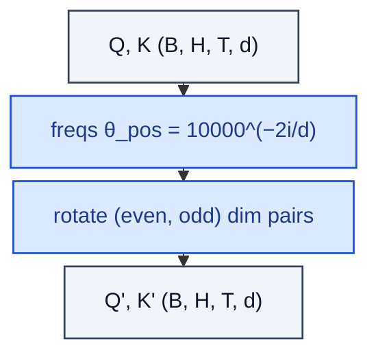

# RotaryEmbedding

> Inject absolute position into Q, K via per-pair rotations.

**Shapes:** `Q,K:(B, H, T, d) → rotated Q,K`

**Used in**

- LLaMA / LLaMA-2 / LLaMA-3, Mistral, Qwen, GPT-NeoX, PaLM
- Most open LLMs since 2022 — RoPE has displaced learned absolute embeddings
- Position-aware variants for image models (RoPE-ViT)

**Tasks**

- Length-extrapolatable position encoding for LLMs
- Continuous-position retrieval and matching

**Common pitfalls**

- Extrapolation beyond training length still degrades — mitigated by YaRN / NTK / Position Interpolation, not eliminated.
- Half-precision needs care: cos/sin tables in fp32, then cast at use site.
- RoPE rotates Q and K but NOT V — a frequent re-implementation bug.

**See also**

- [RoFormer / RoPE (Su et al. 2021)](https://arxiv.org/abs/2104.09864)
- [YaRN (Peng et al. 2023)](https://arxiv.org/abs/2309.00071)
- [NTK-aware RoPE scaling discussion](https://www.reddit.com/r/LocalLLaMA/comments/14lz7j5/ntkaware_scaled_rope_allows_llama_models_to_have/)
