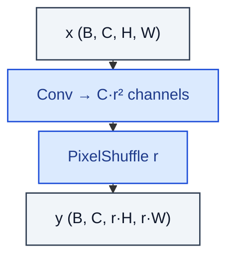

# PixelShuffleUpsample

> Sub-pixel upsampling: rearrange r² channels into r×r spatial blocks.

**Shapes:** `(B, C, H, W) → (B, C, r·H, r·W)`

**Used in**

- ESPCN — original sub-pixel CNN for super-resolution
- EDSR, RCAN, ESRGAN — modern SR architectures
- Diffusion-model decoders / VAE upsampling stages

**Tasks**

- Image super-resolution
- Upsampling within a decoder without introducing checkerboard artefacts

**Common pitfalls**

- Initialisation matters — sub-pixel layers benefit from ICNR init to avoid checkerboards.
- Channel count blows up before the shuffle (C·r²) — memory pressure on large feature maps.
- Equivalent to a learned transpose-conv but typically cheaper at the same quality.

**See also**

- [Sub-pixel CNN / ESPCN (Shi et al. 2016)](https://arxiv.org/abs/1609.05158)
- [Checkerboard Artifacts (Odena et al. 2016)](https://distill.pub/2016/deconv-checkerboard/)
- [ICNR init (Aitken et al. 2017)](https://arxiv.org/abs/1707.02937)
