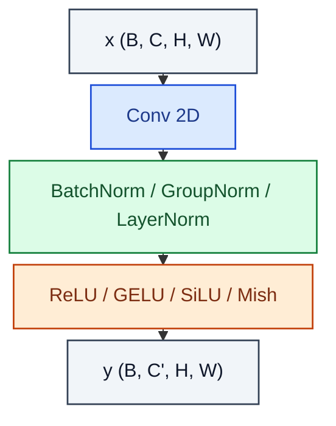

# ConvBlock

> Conv → Norm → Activation, the canonical CNN unit.

**Shapes:** `(B, C, H, W) → (B, C', H, W)`

**Used in**

- VGG, ResNet, EfficientNet — the canonical CNN stem & body
- U-Net encoder/decoder layers
- Generator / discriminator backbones in GANs and diffusion

**Tasks**

- Image classification / segmentation / detection backbones
- Feature extraction prior to global pooling or upsampling

**Common pitfalls**

- Conv → BN → ReLU vs BN → ReLU → Conv (pre-act) matters at depth — pre-activation is more stable for very deep nets.
- Bias on the conv before a BatchNorm is redundant (BN absorbs it).
- Padding mismatches silently change output spatial dims — sanity-check with a forward pass.

**See also**

- [VGG (Simonyan & Zisserman 2014)](https://arxiv.org/abs/1409.1556)
- [BatchNorm (Ioffe & Szegedy 2015)](https://arxiv.org/abs/1502.03167)
- [Pre-activation ResNet (He et al. 2016)](https://arxiv.org/abs/1603.05027)
