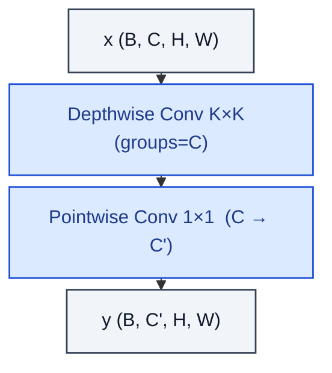

# DepthwiseSeparableConv2d

> Depthwise spatial conv followed by 1×1 pointwise conv (MobileNet).

**Shapes:** `(B, C, H, W) → (B, C', H, W)`

**Used in**

- MobileNet v1 / v2 / v3 — flagship mobile backbones
- Xception — replaces every Inception module with depthwise separable convs
- EfficientNet & EfficientNetV2 — search space built on inverted residuals + DW

**Tasks**

- Edge / mobile inference where FLOPs and parameters must be tiny
- Replacing standard 3×3 convs to cut ~8–9× compute at similar accuracy

**Common pitfalls**

- Memory-bound on GPUs — wall-clock speedup is often less than the FLOP reduction suggests.
- Channel scaling matters: pair with an expansion ratio (inverted residual) or the depthwise stage will bottleneck capacity.
- Some autograd backends fuse standard convs but not depthwise — benchmark first.

**See also**

- [MobileNet v1 (Howard et al. 2017)](https://arxiv.org/abs/1704.04861)
- [MobileNetV2 (Sandler et al. 2018)](https://arxiv.org/abs/1801.04381)
- [Xception (Chollet 2017)](https://arxiv.org/abs/1610.02357)
