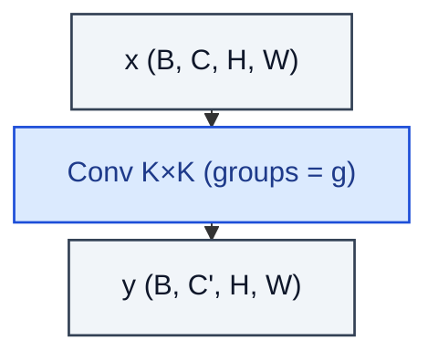

# GroupConv2d

> Conv2d with channel groups (ResNeXt cardinality).

**Shapes:** `(B, C, H, W) → (B, C', H, W)`

**Used in**

- AlexNet — the original use, split across two GPUs
- ResNeXt — uses cardinality (group count) as a third capacity axis
- ShuffleNet — group conv + channel shuffle for cheap exchange

**Tasks**

- Trading per-channel mixing for compute / parameter savings
- Backbone surgery that needs intermediate cost between standard and depthwise conv

**Common pitfalls**

- Information is partitioned across groups — without channel shuffle or a 1×1 mix-up after, capacity drops sharply.
- Groups must divide both `in_ch` and `out_ch`; otherwise it silently errors at build time.

**See also**

- [ResNeXt (Xie et al. 2016)](https://arxiv.org/abs/1611.05431)
- [ShuffleNet (Zhang et al. 2017)](https://arxiv.org/abs/1707.01083)
