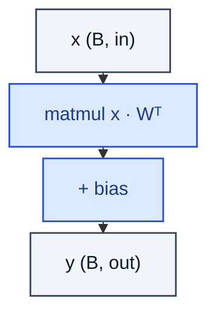

# Linear

> Affine projection y = x · Wᵀ + b.

**Shapes:** `(B, in) → (B, out)`

**Used in**

- Every MLP / classifier / projection head ever
- Q/K/V/O projections inside attention
- Final logits head on language and vision models
- Patch / channel mixers in MLP-Mixer-style nets

**Tasks**

- Any time you need a learned `(B, in) → (B, out)` map
- Bottleneck / expansion in residual blocks
- Read-out heads for regression and classification

**Common pitfalls**

- Initialisation matters — Kaiming for ReLU-family, Xavier for tanh/sigmoid; wrong init can stall training entirely.
- Huge final layers (e.g. softmax over 50k tokens) dominate parameter count — tie input/output embeddings or factorise.
- Forgetting `bias=False` before a BatchNorm is harmless but wasteful.

**See also**

- [Kaiming init (He et al. 2015)](https://arxiv.org/abs/1502.01852)
- [Xavier init (Glorot & Bengio 2010)](https://proceedings.mlr.press/v9/glorot10a.html)
