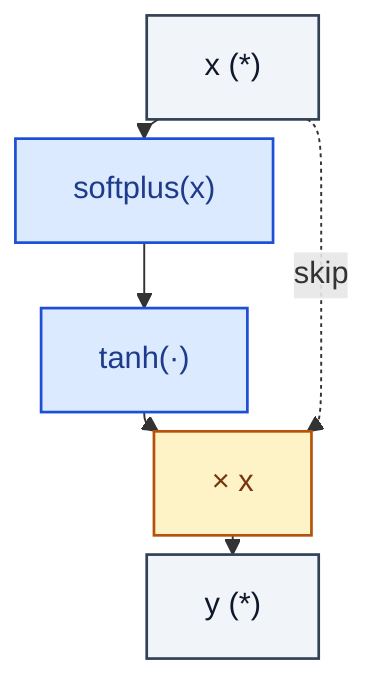

# Mish

> Self-gated activation: x · tanh(softplus(x)).

**Shapes:** `(*) → (*)`

**Used in**

- YOLOv4 and successors — replaced LeakyReLU in the backbone
- CSPNet variants for image classification / detection

**Tasks**

- Drop-in replacement for ReLU/Swish in CNNs aiming for slight accuracy gains

**Common pitfalls**

- More expensive than ReLU/SiLU — measure wall-clock impact, not just FLOPs.
- Smooth-but-nonmonotonic; gradients in the negative tail are small but not zero, which helps deep nets but is not always better than SiLU/GELU.

**See also**

- [Mish (Misra 2019)](https://arxiv.org/abs/1908.08681)
- [YOLOv4 (Bochkovskiy et al. 2020)](https://arxiv.org/abs/2004.10934)
