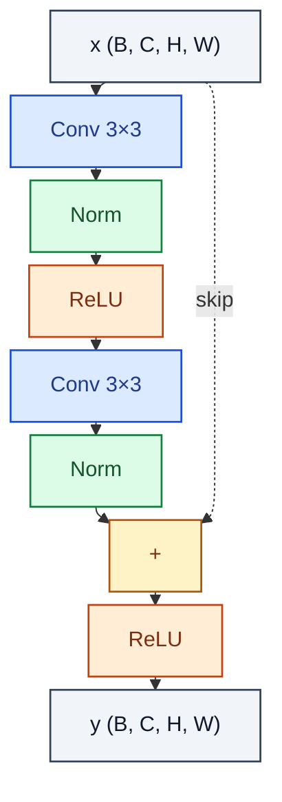

# ResidualBlock

> Two conv-norm-act stack with identity skip and post-add activation.

**Shapes:** `(B, C, H, W) → (B, C, H, W)`

**Used in**

- ResNet-18/34/50/101/152 — the most-cited deep-learning architecture
- U-Net diffusion noise prediction backbone
- AlphaGo / AlphaZero policy-value tower
- Almost every modern CNN backbone (ConvNeXt, RegNet)

**Tasks**

- Enabling depth > 30 layers without vanishing gradients
- Optimisation landscape smoothing — skips create much shorter back-prop paths

**Common pitfalls**

- Pre-activation order (BN → ReLU → Conv) often trains deeper nets more stably than post-act.
- When channel count changes across the skip, you need a 1×1 projection or zero-pad — naïve add will dimension-error.
- ReLU AFTER the add caps activations to ≥ 0, which can hurt; SiLU/GELU is sometimes better.

**See also**

- [ResNet (He et al. 2015)](https://arxiv.org/abs/1512.03385)
- [Pre-activation ResNet (He et al. 2016)](https://arxiv.org/abs/1603.05027)
- [Identity Mappings paper analysis](https://arxiv.org/abs/1603.05027)
