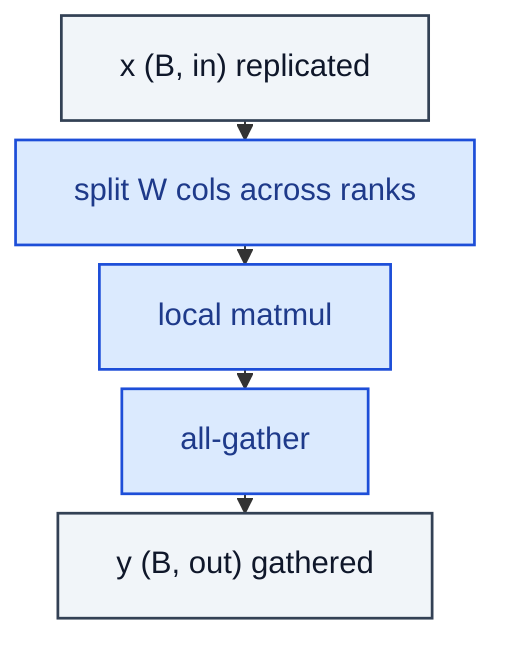

# ColumnParallelLinear

> Linear whose output columns are sharded across tensor-parallel ranks.

**Shapes:** `x → y  (gathered)`

**Used in**

- Megatron-LM tensor parallelism (TP) for LLM training
- DeepSpeed, FasterTransformer, vLLM TP for inference

**Tasks**

- Sharding the Q/K/V/O linears of a Transformer across N GPUs
- Fitting layers that don't fit in a single GPU's memory

**Common pitfalls**

- Pair with RowParallelLinear immediately after (Q→attn→O) so the all-gather and all-reduce cancel out — Megatron's clever design.
- Bias is duplicated across ranks by default — be careful with weight decay accounting.
- Sequence-parallel variant reduces activation memory by another factor of N.

**See also**

- [Megatron-LM (Shoeybi et al. 2019)](https://arxiv.org/abs/1909.08053)
