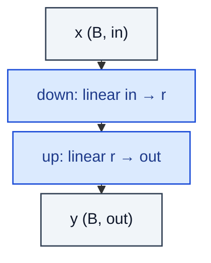

# LowRankLinear

> Two stacked linears whose product approximates a full matrix W ≈ U Vᵀ.

**Shapes:** `(B, in) → (B, out)`

**Used in**

- ALBERT factorised embeddings
- LoRA / DoRA / VeRA — PEFT methods built on low-rank residuals
- Compressed inference (post-training SVD of dense layers)

**Tasks**

- Parameter reduction when in × out ≫ r·(in + out)
- Building block for adapters and intrinsic-dimension fine-tuning

**Common pitfalls**

- Initialisation: down with N(0, σ), up zero — gives identity start when used as residual; wrong order produces gradient surprises.
- Rank r should be < min(in, out) for any saving; too small loses expressivity.
- Two matmuls have a latency cost on small GPUs vs a single fused matmul.

**See also**

- [ALBERT (Lan et al. 2019)](https://arxiv.org/abs/1909.11942)
- [LoRA (Hu et al. 2021)](https://arxiv.org/abs/2106.09685)
- [Intrinsic Dimensionality (Aghajanyan et al. 2020)](https://arxiv.org/abs/2012.13255)
