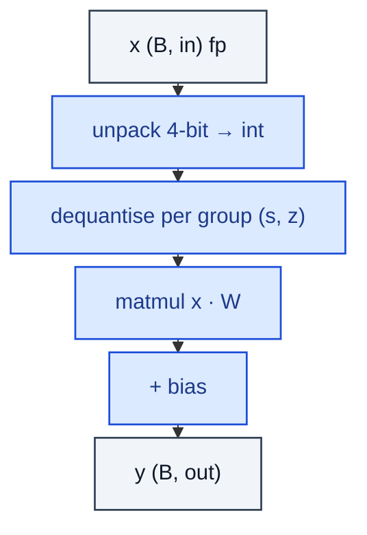

# QuantizedLinear4bit

> Linear with weights packed to 4-bit + grouped scales / zeros (NF4 / GPTQ style).

**Shapes:** `(B, in) → (B, out)`

**Used in**

- QLoRA — NF4 storage + LoRA fine-tuning on consumer GPUs
- GPTQ / AWQ — post-training quantisation methods
- llama.cpp Q4_0 / Q4_K — ggml community quantisations

**Tasks**

- 4× memory reduction to fit 30B+ models in 24 GB VRAM
- Cheap LoRA fine-tuning on top of 4-bit base weights

**Common pitfalls**

- Group size (32 / 64 / 128) trades accuracy for memory of scales+zeros — 64–128 typical.
- Activation outliers degrade 4-bit quality more than int8; AWQ / GPTQ post-tune the choice.
- Saving 4-bit weights as 8-bit packed bytes is essential; many bugs come from accidental fp16 inflation in the loader.
- Backward through a 4-bit weight requires bf16 / fp16 dequant on the fly — slower than int8.

**See also**

- [QLoRA / NF4 (Dettmers et al. 2023)](https://arxiv.org/abs/2305.14314)
- [GPTQ (Frantar et al. 2022)](https://arxiv.org/abs/2210.17323)
- [AWQ (Lin et al. 2023)](https://arxiv.org/abs/2306.00978)
