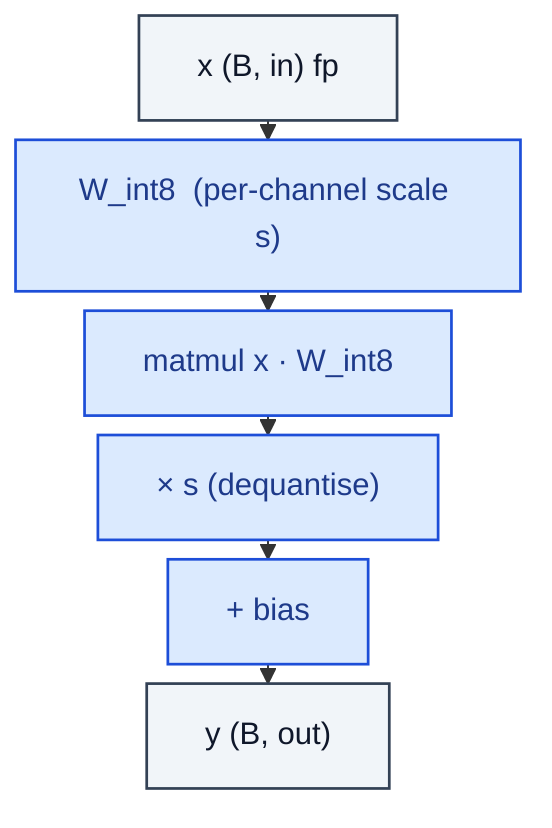

# QuantizedLinearInt8

> Linear with weights stored in int8 + per-output-channel scale.

**Shapes:** `(B, in) → (B, out)`

**Used in**

- LLM.int8() / bitsandbytes — first widely-deployed int8 LLM inference
- SmoothQuant — outlier-aware activation+weight quantisation
- PyTorch quantisation, TensorRT, ONNX Runtime

**Tasks**

- 2× inference speedup and ~2× memory reduction on int8-capable hardware
- Deploying large LLMs on commodity GPUs (e.g. LLaMA-65B → single A100)

**Common pitfalls**

- Outlier channels can blow up the dynamic range — LLM.int8() detects them and runs fp16 for those rows; SmoothQuant rebalances activations into weights.
- Per-channel scales are essential; per-tensor scales lose accuracy on LLMs.
- Activations are NOT quantised here — that step (AQA) is a separate decision.

**See also**

- [LLM.int8() (Dettmers et al. 2022)](https://arxiv.org/abs/2208.07339)
- [SmoothQuant (Xiao et al. 2022)](https://arxiv.org/abs/2211.10438)
- [bitsandbytes](https://github.com/TimDettmers/bitsandbytes)
