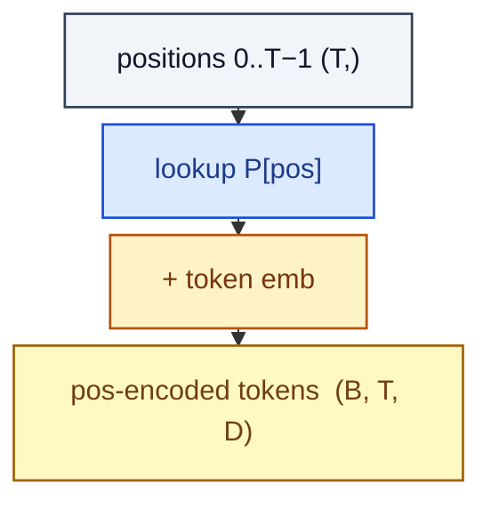

# LearnedPositionalEmbedding

> A separate learned vector per absolute position, added to the token embedding.

**Shapes:** `(B, T, D) → (B, T, D)`

**Used in**

- BERT, RoBERTa, GPT-2 — original Transformer-era position encoding
- ViT — learned position embeddings per patch

**Tasks**

- Position injection for fixed-length sequences

**Common pitfalls**

- Cannot extrapolate beyond the training length without interpolation/extension hacks.
- Adds D × T_max parameters — large at long contexts.
- Largely replaced by RoPE / ALiBi in modern LLMs for length extrapolation reasons.

**See also**

- [BERT (Devlin et al. 2018)](https://arxiv.org/abs/1810.04805)
- [ViT (Dosovitskiy et al. 2020)](https://arxiv.org/abs/2010.11929)
