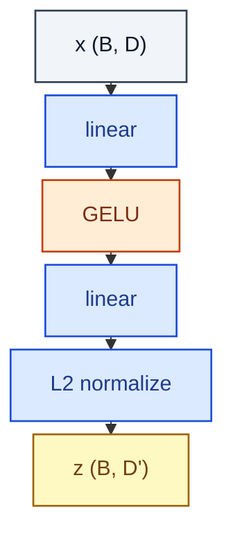

# ProjectionHead

> Two-layer MLP + L2 normalisation, used for contrastive / representation learning.

**Shapes:** `(B, D) → (B, D')`

**Used in**

- SimCLR, MoCo, BYOL — contrastive image SSL
- CLIP, BLIP — image-text alignment heads
- Sentence-BERT, GTE, BGE — text embedding models

**Tasks**

- Mapping features to a contrastive / retrieval space (often discarded after pretraining)
- Stable training of contrastive losses (the head absorbs feature distortion)

**Common pitfalls**

- L2 normalisation is essential before computing cosine similarity / temperature softmax.
- Projector is typically DISCARDED at inference — use the pre-projection features instead (SimCLR §6, MoCo v2).
- Width and depth of the projector matter more than people expect (BYOL has 4096-d hidden).

**See also**

- [SimCLR (Chen et al. 2020)](https://arxiv.org/abs/2002.05709)
- [MoCo v2 (Chen et al. 2020)](https://arxiv.org/abs/2003.04297)
- [BYOL (Grill et al. 2020)](https://arxiv.org/abs/2006.07733)
