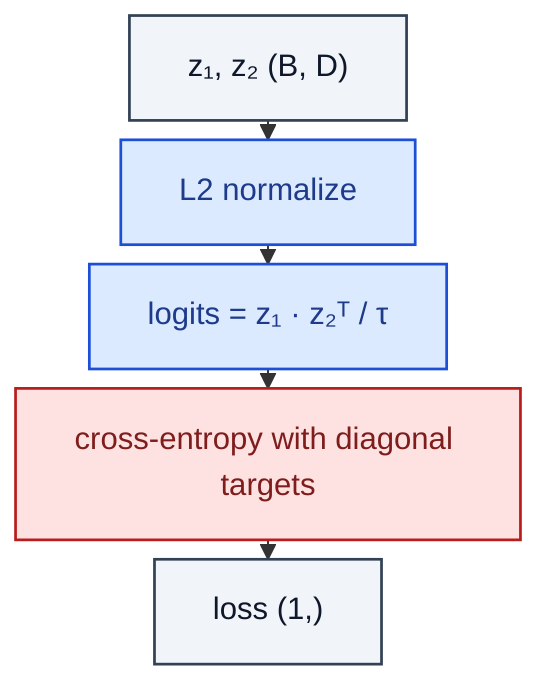

# info_nce

> Pairwise InfoNCE used by SimCLR / MoCo.

**Shapes:** `z₁, z₂:(B, D) → loss`

**Used in**

- SimCLR, MoCo, MoCo-v3 — image SSL
- CPC (van den Oord et al. 2018) — sequential predictive coding
- DINO-style methods (with teacher target)

**Tasks**

- Self-supervised representation learning from augmented views
- Cross-modal alignment (when restricted to one direction)

**Common pitfalls**

- Temperature τ ~0.07–0.2 is typical — far off and the loss saturates or vanishes.
- Need many negatives; without a memory bank (MoCo) or large batch, quality plateaus.
- Hard-negative mining helps in fine-grained settings (face recognition, retrieval).

**See also**

- [CPC / InfoNCE (van den Oord et al. 2018)](https://arxiv.org/abs/1807.03748)
- [SimCLR (Chen et al. 2020)](https://arxiv.org/abs/2002.05709)
- [MoCo (He et al. 2019)](https://arxiv.org/abs/1911.05722)
