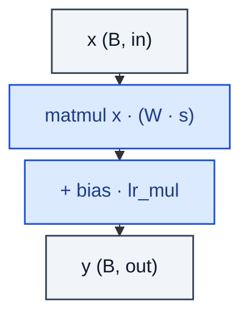

# EqualLinear

> Linear with equalized learning rate: weight scaled at runtime by gain/√fan_in.

**Shapes:** `(B, in) → (B, out)`

**Used in**

- PGGAN, StyleGAN, StyleGAN2/3 — every fully-connected layer
- MSG-GAN, GANformer — high-quality image synthesis

**Tasks**

- Maintaining uniform per-parameter learning rate across layers of vastly different fan-in
- Stable training of progressively-growing or modulated generators

**Common pitfalls**

- Naïve replacement of Linear with EqualLinear without adjusting LR ratios degrades quality.
- Scale factor is APPLIED at runtime, not at init — keeping weights N(0,1) and scaling on forward is the whole point.
- Mixing standard and equalised layers in the same net usually hurts; commit to one.

**See also**

- [PGGAN (Karras et al. 2017)](https://arxiv.org/abs/1710.10196)
- [StyleGAN (Karras et al. 2019)](https://arxiv.org/abs/1812.04948)
