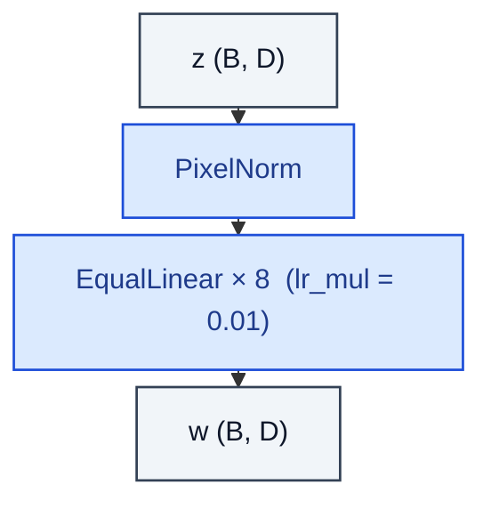

# MappingNetwork

> 8-layer MLP with reduced LR that maps z → w (StyleGAN).

**Shapes:** `z:(B, D) → w:(B, D)`

**Used in**

- StyleGAN v1 / v2 / v3 — the f: z → w map
- StyleGAN-T text-to-image

**Tasks**

- Disentangling latent noise into a more linear style space W
- Enabling style mixing and W+ inversion / editing

**Common pitfalls**

- Without the low LR multiplier (~0.01), the mapping net dominates training updates.
- Skipping PixelNorm on z makes early training unstable.
- Depth of 8 is empirical; smaller maps under-disentangle, deeper maps offer no gains.

**See also**

- [StyleGAN (Karras et al. 2019)](https://arxiv.org/abs/1812.04948)
