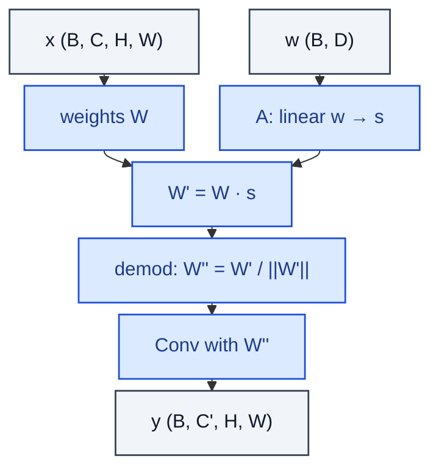

# ModulatedConv2d

> StyleGAN2 modulated conv: scale weights by style, demodulate, then convolve.

**Shapes:** `x:(B, C, H, W), w:(B, D) → y`

**Used in**

- StyleGAN2 / StyleGAN3 generator (replaces AdaIN style injection)
- Modulated decoders in modern image synthesis

**Tasks**

- Style injection through weight modulation rather than feature statistics
- Eliminating droplet artefacts caused by AdaIN

**Common pitfalls**

- Demodulation factor is computed PER OUTPUT CHANNEL — bookkeeping error breaks training.
- Grouped convolution implementation per sample is needed (since W differs per batch element) — naïve loop is too slow; use grouped conv with B groups.
- Style vector s is BROADCAST over spatial — confusing AdaIN's spatial γ/β with this is wrong.

**See also**

- [StyleGAN2 (Karras et al. 2020)](https://arxiv.org/abs/1912.04958)
- [StyleGAN3 (Karras et al. 2021)](https://arxiv.org/abs/2106.12423)
