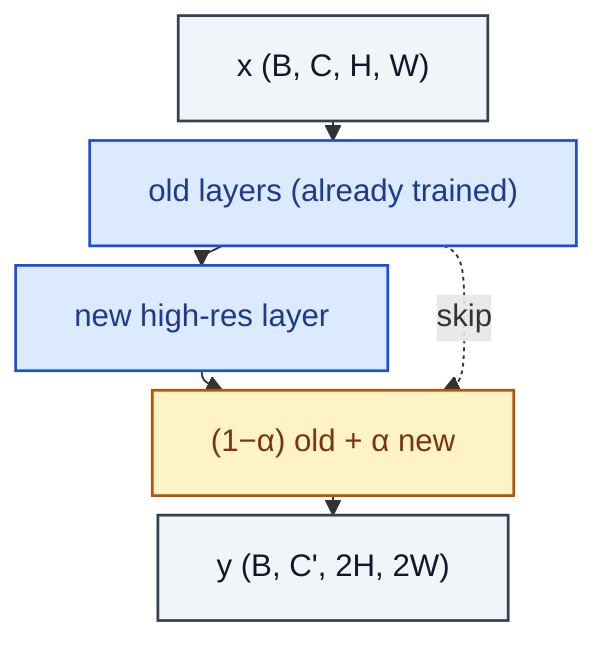

# ProgressiveGrowing

> Fade in a new high-res block via α-blend with the previous resolution (PGGAN).

**Shapes:** `x → upsampled / new block → y`

**Used in**

- PGGAN — first method to scale GANs to 1024² faces
- Some MSG-GAN and progressive diffusion variants

**Tasks**

- Stable training of very high-resolution GANs
- Reducing training-divergence risk by gradually expanding capacity

**Common pitfalls**

- α schedule must be slow enough — abrupt fade-in destabilises training.
- Discriminator and generator must grow in LOCK-STEP; mismatched resolutions diverge.
- Replaced in modern recipes by StyleGAN2/3 single-shot training, which is simpler.

**See also**

- [PGGAN (Karras et al. 2017)](https://arxiv.org/abs/1710.10196)
