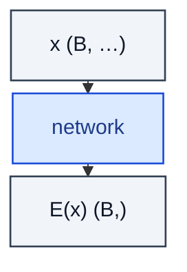

# EnergyBasedModel

> A network that maps x to a scalar energy E(x); samples drawn via Langevin/MCMC.

**Shapes:** `x → E(x):(B,)`

**Used in**

- Implicit Generation (Du & Mordatch 2019)
- JEM — joint generative-discriminative training
- Score-based models (gradient of log-density ≈ −∇E)

**Tasks**

- Density modelling without a tractable partition function
- Out-of-distribution detection (low energy = in-distribution)

**Common pitfalls**

- Training is unstable — contrastive divergence and short-run MCMC are common workarounds.
- Sampling needs Langevin dynamics or HMC — slow compared to feed-forward generators.
- Mode coverage is poor without replay buffers and persistent chains.

**See also**

- [Implicit Generation (Du & Mordatch 2019)](https://arxiv.org/abs/1903.08689)
- [JEM (Grathwohl et al. 2019)](https://arxiv.org/abs/1912.03263)
- [A Tutorial on EBMs (LeCun et al. 2006)](http://yann.lecun.com/exdb/publis/pdf/lecun-06.pdf)
