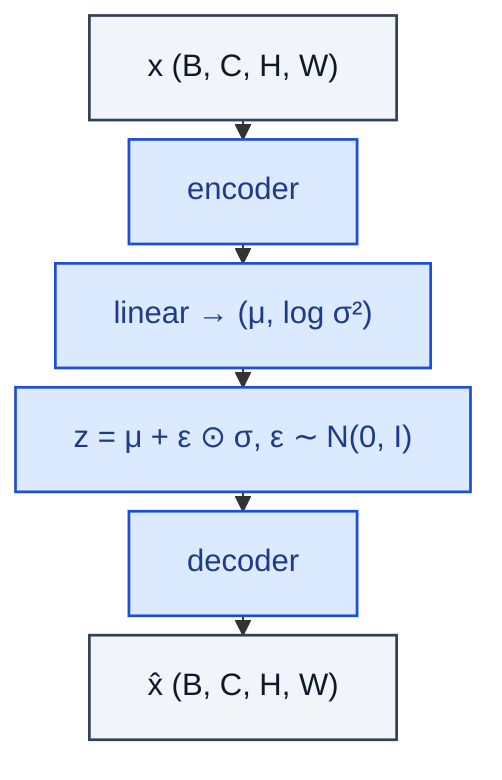

# VAE

> Encoder → posterior (μ, σ) → reparameterised z → decoder.

**Shapes:** `(B, C, H, W) → (B, C, H, W)`

**Used in**

- VAE (Kingma & Welling 2013) — original deep generative latent-variable model
- VQ-VAE / VQ-VAE-2 — discrete-latent variants for images / audio
- Stable Diffusion's image autoencoder (compresses pixels → 8× smaller latents)
- Talking-head and motion synthesis (FaceVAE)

**Tasks**

- Unsupervised representation learning with explicit latent prior
- Low-dimensional latent space for downstream models (e.g. diffusion on latents)
- Anomaly detection (high reconstruction loss = unusual sample)

**Common pitfalls**

- Posterior collapse — z carries no information when the decoder is too powerful. Mitigate with β-VAE (down-weight KL), free-bits, or KL warmup.
- Blurry reconstructions are a known limitation of pixel L2 / L1 — perceptual or adversarial loss helps (SD's AE uses both).
- Reparameterisation must use ε ~ N(0,I) during training and z = μ at inference for deterministic encoding.

**See also**

- [VAE (Kingma & Welling 2013)](https://arxiv.org/abs/1312.6114)
- [β-VAE (Higgins et al. 2017)](https://openreview.net/forum?id=Sy2fzU9gl)
- [VQ-VAE (van den Oord et al. 2017)](https://arxiv.org/abs/1711.00937)
