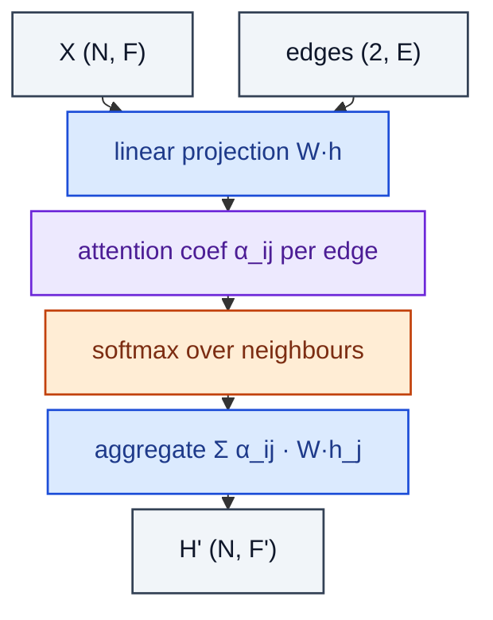

# GraphAttention

> GAT: per-edge attention coefficients followed by neighbour aggregation.

**Shapes:** `X:(N, F), edges → H':(N, F')`

**Used in**

- GAT, GATv2 — node classification, relation prediction
- Mesh / point-cloud learning (Point Transformer)
- Heterogeneous graph attention (HAN, HGT)

**Tasks**

- Tasks needing differential edge importance
- Heterogeneous graphs where edge types carry semantics

**Common pitfalls**

- Original GAT (v1) has a static attention pattern that GATv2 fixes — use GATv2.
- Softmax over neighbours requires segment-softmax (scatter softmax); naïve dense impl OOMs.
- Attention quality degrades when nodes have very high degree — sample or sparsify.
- Multi-head attention helps but multiplies compute; concatenation vs averaging changes downstream dim.

**See also**

- [GAT (Veličković et al. 2017)](https://arxiv.org/abs/1710.10903)
- [GATv2 (Brody et al. 2021)](https://arxiv.org/abs/2105.14491)
