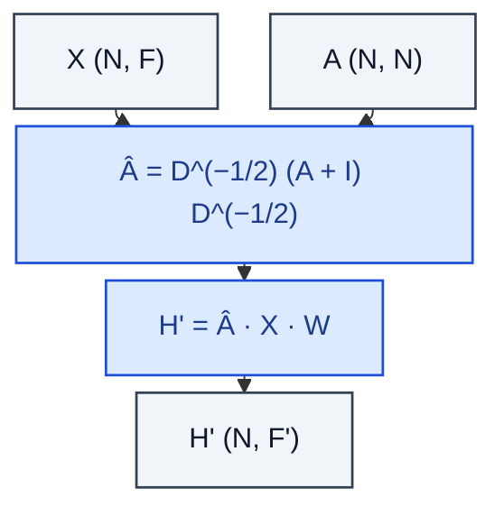

# GraphConv

> GCN propagation: H' = Â · X · W with symmetric normalisation.

**Shapes:** `X:(N, F), A:(N, N) → H':(N, F')`

**Used in**

- Kipf & Welling GCN (citation, classification on Cora/Citeseer/Pubmed)
- Baseline GNN in nearly every paper since 2017
- Semi-supervised node classification, link prediction

**Tasks**

- Transductive node classification with a single fixed graph
- Strong baseline before reaching for attention or sampling

**Common pitfalls**

- Symmetric normalisation needs SELF-loops (A+I) — forgetting them silently halves performance.
- Full-batch propagation needs the whole graph in memory — doesn't scale to billions of nodes.
- Limited expressive power — cannot distinguish certain regular structures (see WL test).
- Over-smoothing kicks in by layer 3–4; very deep GCNs underperform 2-layer GCNs.

**See also**

- [GCN (Kipf & Welling 2016)](https://arxiv.org/abs/1609.02907)
- [How Powerful Are GNNs (Xu et al. 2018)](https://arxiv.org/abs/1810.00826)
