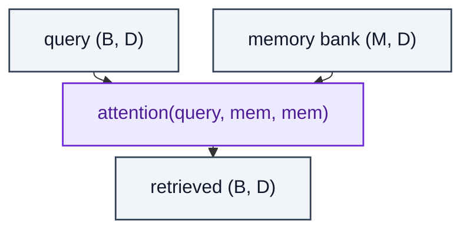

# ExternalMemory

> Soft attention over an external memory bank acts as a read operation.

**Shapes:** `q:(B, D), mem:(M, D) → r:(B, D)`

**Used in**

- Neural Turing Machines / Differentiable Neural Computers
- Memory-Augmented Networks (MANN)
- Memorizing Transformers (Wu et al. 2022)

**Tasks**

- Few-shot learning where context is too large to keep in attention
- Long-term episodic memory in agents

**Common pitfalls**

- Memory bank grows unbounded — needs eviction policy or summarisation.
- Soft addressing is slow to learn — hard / sparse attention often does better in practice but is non-differentiable.
- Mostly superseded by retrieval (RAG / kNN-LM) for language tasks.

**See also**

- [Neural Turing Machines (Graves et al. 2014)](https://arxiv.org/abs/1410.5401)
- [DNC (Graves et al. 2016)](https://www.nature.com/articles/nature20101)
- [Memorizing Transformers (Wu et al. 2022)](https://arxiv.org/abs/2203.08913)
