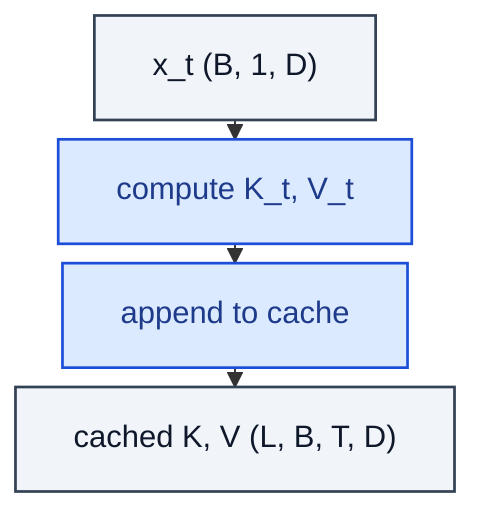

# KVCache

> Cache K, V tensors per layer per token to skip re-encoding history.

**Shapes:** `x_t → K_{1..t}, V_{1..t}`

**Used in**

- Every production LLM inference stack (vLLM, TGI, TensorRT-LLM, llama.cpp)
- PagedAttention / vLLM's blocked KV cache
- Speculative decoding pipelines

**Tasks**

- Reducing autoregressive inference from O(T²) to O(T) per token
- Batched serving across multiple concurrent sessions

**Common pitfalls**

- Memory is the bottleneck — `L × B × T × 2 × D` in fp16 is huge for long contexts.
- Multi-Query / Grouped-Query Attention shrink the cache (1 or g K-V heads instead of H).
- Beam search and continuous-batching need careful cache-block layout (see PagedAttention).
- Quantising the cache (FP8 / INT8) saves memory but can hurt long-context accuracy.

**See also**

- [Multi-Query Attention (Shazeer 2019)](https://arxiv.org/abs/1911.02150)
- [Grouped-Query Attention (Ainslie et al. 2023)](https://arxiv.org/abs/2305.13245)
- [PagedAttention / vLLM (Kwon et al. 2023)](https://arxiv.org/abs/2309.06180)
