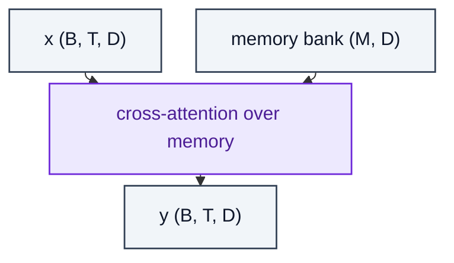

# MemoryAttention

> Cross-attention layer that reads from an external memory bank.

**Shapes:** `x:(B, T, D), mem:(M, D) → (B, T, D)`

**Used in**

- Memorizing Transformers (Wu et al. 2022) — kNN-augmented attention
- Retro / Retro-fitted models
- Agentic memory layers (long-term episodic memory)

**Tasks**

- Extending effective context via retrieval-as-attention
- Personalisation by storing user-specific tokens in memory

**Common pitfalls**

- Memory bank size grows over time — needs eviction or summarisation.
- Approximate kNN (top-k) over memory is essential for scale; exhaustive dot-product is infeasible past ~10⁶ items.
- Training distribution and memory distribution can diverge — periodic refresh helps.

**See also**

- [Memorizing Transformers (Wu et al. 2022)](https://arxiv.org/abs/2203.08913)
- [kNN-LM (Khandelwal et al. 2019)](https://arxiv.org/abs/1911.00172)
