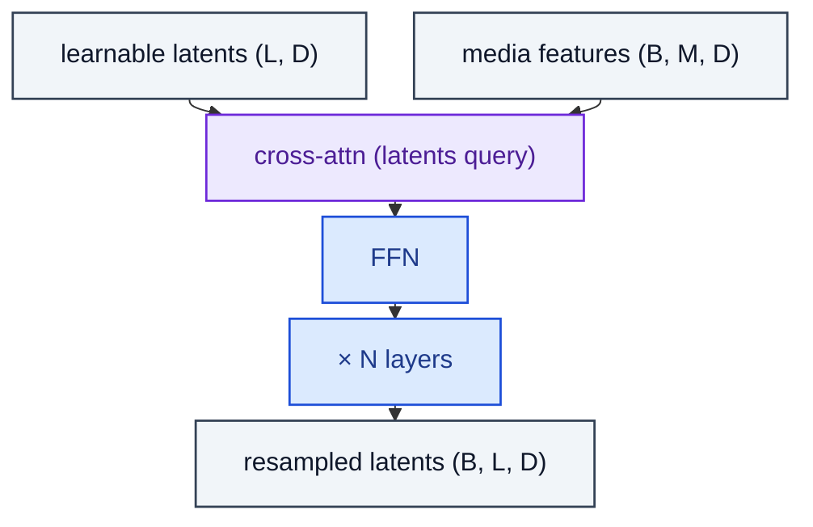

# PerceiverResampler

> Fixed-length learnable latents cross-attend over arbitrary-length media features.

**Shapes:** `media:(B, M, D), latents:(L, D) → (B, L, D)`

**Used in**

- Perceiver / Perceiver IO — modality-agnostic encoder
- Flamingo's Perceiver Resampler (downsamples video frames to fixed token count)
- Idefics, OpenFlamingo — open-source Flamingo replicas

**Tasks**

- Compressing variable-length media (video, audio, point clouds) to fixed-length tokens
- Cross-modal pre-pooling before passing to a language model

**Common pitfalls**

- Number of latents L is a hard hyperparameter — too small loses info, too large defeats the purpose.
- Cross-attention with M ≫ L still costs O(L·M) per layer — not free.
- Latents are PER MODEL, not per sample — same latents broadcast across the batch.

**See also**

- [Perceiver (Jaegle et al. 2021)](https://arxiv.org/abs/2103.03206)
- [Perceiver IO (Jaegle et al. 2021)](https://arxiv.org/abs/2107.14795)
- [Flamingo (Alayrac et al. 2022)](https://arxiv.org/abs/2204.14198)
