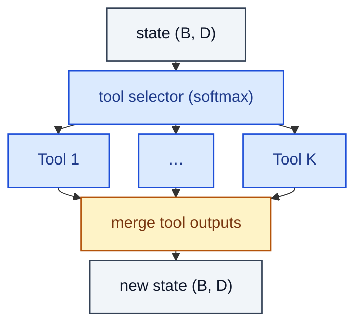

# ToolUseBlock

> Soft selector over a set of tools, each invoked, results merged back into the state.

**Shapes:** `state → updated state`

**Used in**

- Toolformer — LM learns when to call APIs via self-supervised tags
- Gorilla, ToolLLM — tool-use fine-tuning of open LLMs
- OpenAI function calling / Anthropic tool use APIs (in spirit)
- ReAct / MRKL agent patterns

**Tasks**

- Agentic LLMs that delegate sub-tasks to calculators, search, code interpreters
- Modular pipelines that compose deterministic tools with neural reasoning

**Common pitfalls**

- Soft routing rarely beats hard selection in deployed systems — most production agents do hard calls with thresholding.
- Tool latency dominates end-to-end response time; pipeline parallelism helps.
- Error propagation: failed tool returns must be turned into tokens the LM can correct from.

**See also**

- [Toolformer (Schick et al. 2023)](https://arxiv.org/abs/2302.04761)
- [ReAct (Yao et al. 2022)](https://arxiv.org/abs/2210.03629)
- [Gorilla (Patil et al. 2023)](https://arxiv.org/abs/2305.15334)
