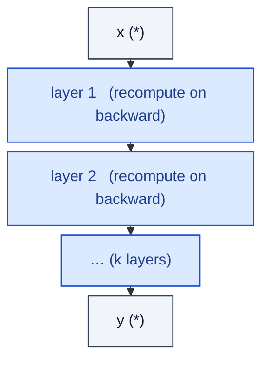

# CheckpointedSequential

> Sequential whose forward is rematerialised on the backward pass to save memory.

**Shapes:** `(*) → (*)`

**Used in**

- Training of huge models (LLaMA, GPT-NeoX, Megatron-LM)
- Diffusion U-Nets and ViT-Huge fine-tuning
- PyTorch's `torch.utils.checkpoint`

**Tasks**

- Fitting deeper / wider models into a fixed memory budget
- Long-context training where activation memory is the binding constraint

**Common pitfalls**

- ~30 % slower per step due to the extra forward — only worth it if memory was the bottleneck.
- Doesn't compose well with non-determinism (dropout) unless you set `use_reentrant=False` or seed correctly.
- Checkpointing across optimizer step is wrong — only the FORWARD activations are rematerialised.
- Selective Activation Checkpointing (Megatron-LM) typically beats blind layer-wise CKPT.

**See also**

- [Gradient Checkpointing (Chen et al. 2016)](https://arxiv.org/abs/1604.06174)
- [Megatron Selective Activation Recompute (Korthikanti et al. 2022)](https://arxiv.org/abs/2205.05198)
