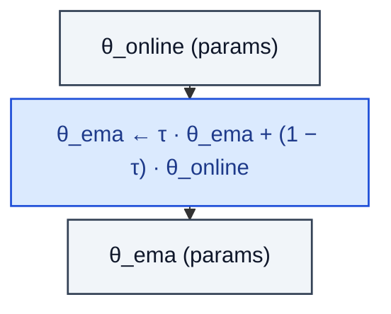

# EMA

> Exponential moving average of model weights.

**Shapes:** `θ_online → θ_ema`

**Used in**

- BYOL / MoCo — momentum-encoder target
- Diffusion models — EMA of weights used for SAMPLING (essential for FID)
- Mean-teacher semi-supervised learning
- Reinforcement-learning target networks (effectively a hard-step EMA)

**Tasks**

- Stabilising self-supervised / generative training
- Improving generalisation by averaging across the training trajectory
- Decoupling sampling-time weights from training weights

**Common pitfalls**

- EMA copy doubles the parameter memory — be aware on large models.
- Decay τ near 1 (e.g. 0.9999) is typical for diffusion; lower for SSL momentum encoders.
- Don't average buffers (batch-norm running stats, optimizer state) — only weights.
- Loading EMA weights into the training model at resume is a common bug.

**See also**

- [Polyak averaging (Polyak & Juditsky 1992)](https://epubs.siam.org/doi/10.1137/0330046)
- [BYOL (Grill et al. 2020)](https://arxiv.org/abs/2006.07733)
- [Improved DDPM (Nichol & Dhariwal 2021)](https://arxiv.org/abs/2102.09672)
