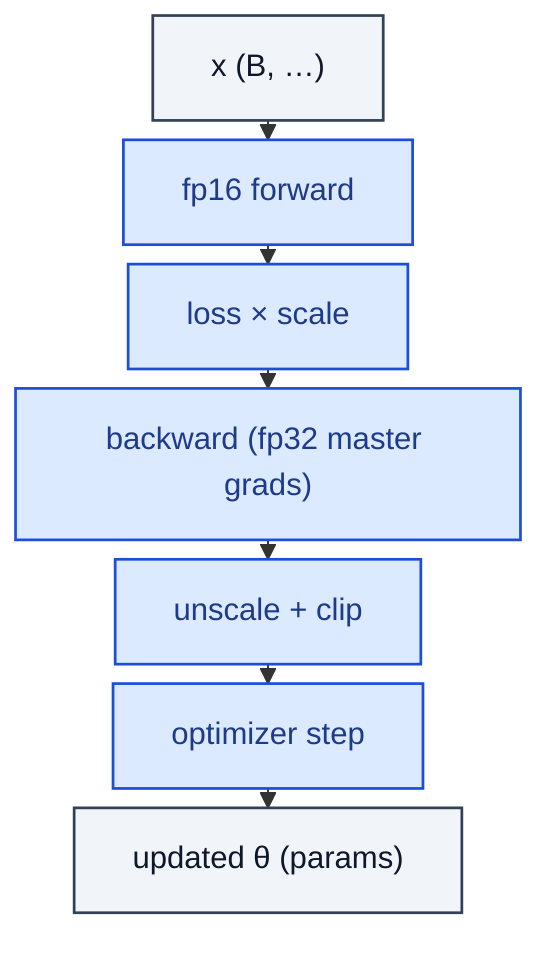

# MixedPrecisionTrainer

> Loss-scaled fp16 forward, fp32 master weights, gradient unscale + clip + step.

**Shapes:** `x → updated θ`

**Used in**

- torch.cuda.amp / torch.amp
- DeepSpeed, Megatron-LM training stacks
- JAX with bfloat16 / float16 mixed precision

**Tasks**

- Doubling training throughput on tensor-core hardware (V100, A100, H100)
- Halving memory usage to fit larger batch / model sizes

**Common pitfalls**

- fp16 underflow on small gradients — loss scaling required (or use bf16 with no loss scale).
- Overflow → dynamic scale halves; thrashing scales hurt convergence — log them.
- BatchNorm and softmax should stay fp32 — autocast handles this, manual impls don't.
- bf16 has wider range than fp16, narrower mantissa — usually preferred on A100+ and TPUs.

**See also**

- [Mixed Precision Training (Micikevicius et al. 2017)](https://arxiv.org/abs/1710.03740)
- [bfloat16 (Wang & Kanwar 2019)](https://cloud.google.com/blog/products/ai-machine-learning/bfloat16-the-secret-to-high-performance-on-cloud-tpus)
