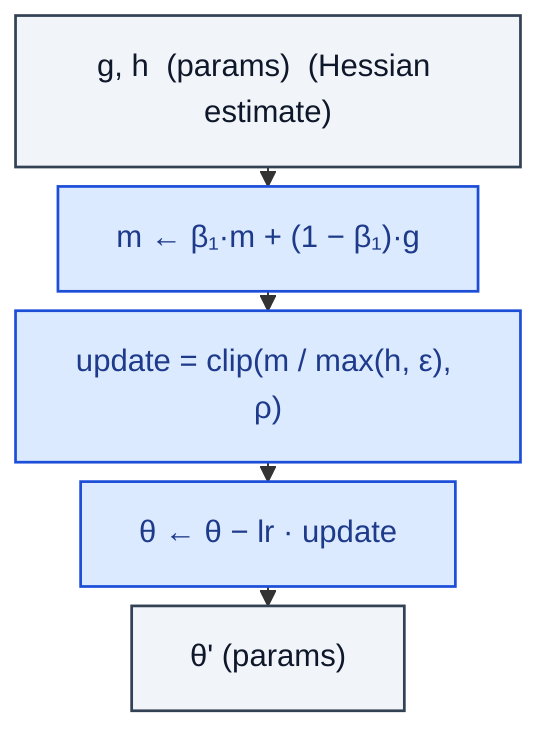

# Sophia

> Hessian-clipped second-order optimiser.

**Shapes:** `g, h, θ → θ'`

**Used in**

- GPT-2 125M..1.5B reproductions (claim ~2× speedup vs AdamW)
- Research code-bases experimenting with second-order methods at scale

**Tasks**

- Language-model pretraining where Hessian heterogeneity across dims is large
- Reducing the compute / wall-clock budget for matching a target perplexity

**Common pitfalls**

- Hessian diagonal estimate via Hutchinson is noisy — must average across many steps (default: every k iterations).
- Clipping bound ρ matters — too tight blocks progress, too loose loses the second-order signal.
- Independent reproductions show smaller gains than the paper at very large scale.
- Per-step overhead is small only because Hessian is updated INTERMITTENTLY — implementations that update every step are much slower.

**See also**

- [Sophia (Liu et al. 2023)](https://arxiv.org/abs/2305.14342)
- [Sophia implementation](https://github.com/Liuhong99/Sophia)
