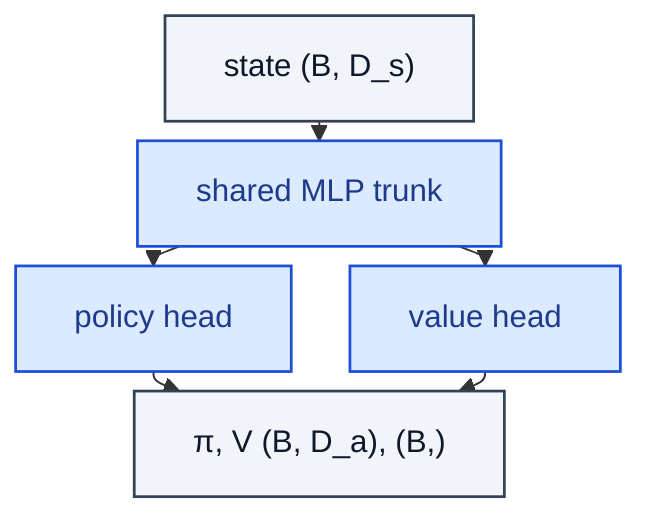

# ActorCritic

> Shared trunk that branches into a policy head and a value head.

**Shapes:** `s → π(a | s),  V(s)`

**Used in**

- A2C / A3C — original sync / async actor-critic
- PPO — clipped policy ratio + value loss on the same trunk
- IMPALA — distributed actor-critic with V-trace corrections
- MuZero — model + policy + value heads on a shared latent

**Tasks**

- Sample-efficient on-policy learning where critic reduces policy-gradient variance
- Large-scale distributed RL where one trunk feeds many workers
- RLHF — actor outputs token distributions, critic scores partial responses for advantage computation

**Common pitfalls**

- Policy and value losses compete for trunk capacity — clip the value loss or weight it (`c_v ≈ 0.5`).
- Entropy bonus is essential for exploration in early training; anneal it as the policy sharpens.
- Gradient norm explodes on bad batches — global-norm clip (typically 0.5–1.0).

**See also**

- [A3C (Mnih et al. 2016)](https://arxiv.org/abs/1602.01783)
- [PPO (Schulman et al. 2017)](https://arxiv.org/abs/1707.06347)
- [IMPALA (Espeholt et al. 2018)](https://arxiv.org/abs/1802.01561)
