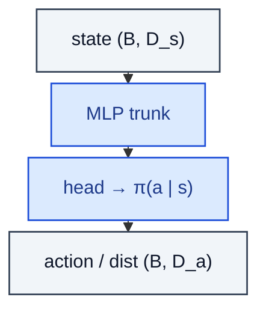

# PolicyNetwork

> Maps a state to an action distribution / Gaussian (μ, σ) / discrete logits.

**Shapes:** `s:(B, D_s) → π(a | s)`

**Used in**

- REINFORCE — vanilla policy gradient
- A2C / A3C — synchronous & asynchronous actor-critic
- TRPO / PPO — trust-region / clipped policy improvement
- SAC — entropy-regularised stochastic policy for continuous control
- Decision-Transformer policies for offline RL

**Tasks**

- Continuous control (MuJoCo, robotic manipulation, locomotion)
- Discrete-action games (Atari, board games, card games)
- Dialogue / tool-use policies in LLM agents (RLHF, RLAIF)
- Anywhere you need a *stochastic* mapping `state → action`

**Common pitfalls**

- High-variance gradients — pair with a value baseline / GAE.
- Action squashing (`tanh`) breaks log-probability — use the tanh-squashed-Gaussian correction.
- Stochastic policies can collapse to a deterministic mode; add an entropy bonus (SAC, max-ent RL).
- Discrete-action heads need numerically-stable softmax + log-softmax for the log-prob (don't compute `log(softmax(x))` naively).

**See also**

- [REINFORCE (Williams 1992)](https://link.springer.com/article/10.1007/BF00992696)
- [A3C (Mnih et al. 2016)](https://arxiv.org/abs/1602.01783)
- [PPO (Schulman et al. 2017)](https://arxiv.org/abs/1707.06347)
- [SAC (Haarnoja et al. 2018)](https://arxiv.org/abs/1801.01290)
