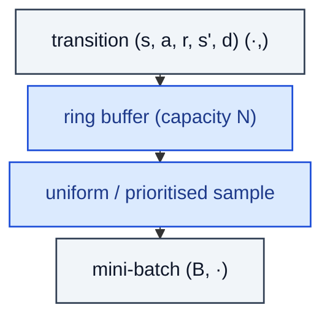

# ReplayBuffer

> Ring buffer storing transitions; sampled in mini-batches for off-policy learning.

**Shapes:** `(s, a, r, s', d) → batch`

**Used in**

- DQN — original uniform-replay experience buffer
- PER — sampling proportional to TD-error magnitude
- DDPG / SAC / TD3 — off-policy continuous control
- Ape-X / R2D2 — distributed prioritised replay at scale
- HER — Hindsight Experience Replay for sparse-reward goals

**Tasks**

- Breaking temporal correlation in updates
- Reusing rare / high-value transitions many times
- Off-policy correction when the data-generating policy differs from the current learner

**Common pitfalls**

- Buffer stays full of stale data when the policy drifts fast; tune capacity vs. update ratio.
- PER without importance-sampling weights introduces bias — always anneal β from ~0.4 → 1.0.
- Storing full image observations is RAM-heavy — use frame stacks + uint8 storage, decode in the worker.
- Multi-step returns need transition aggregation (n-step) before sampling, not after.

**See also**

- [Experience replay (Lin 1992)](https://link.springer.com/article/10.1007/BF00992699)
- [Prioritised Experience Replay (Schaul et al. 2015)](https://arxiv.org/abs/1511.05952)
- [Hindsight Experience Replay (Andrychowicz et al. 2017)](https://arxiv.org/abs/1707.01495)
- [Ape-X (Horgan et al. 2018)](https://arxiv.org/abs/1803.00933)
