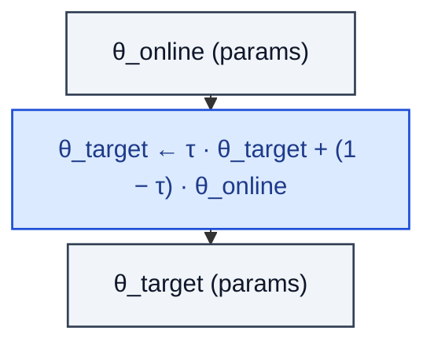

# TargetNetwork

> Slowly-tracking copy of the online network used to stabilise bootstrap targets.

**Shapes:** `θ_online → θ_target`

**Used in**

- DQN — hard copy every C steps
- DDPG / TD3 / SAC — soft Polyak averaging (`τ ≈ 0.005`)
- MuZero — separate target net for the value prediction head
- Distillation pipelines — teacher network tracking a moving average of the student

**Tasks**

- Stabilising the bootstrap target in TD-learning
- Decoupling target evaluation from policy improvement to avoid moving-goalposts divergence

**Common pitfalls**

- τ too high → targets move fast → instability (oscillating Q).
- τ too low → slow learning, lagging targets.
- Forgetting to detach `θ_target` from the autograd graph leaks gradients into the target — always `with torch.no_grad():`.
- Hard copies every C steps cause periodic learning spikes; soft updates smooth them.

**See also**

- [DQN (Mnih et al. 2015, Nature)](https://www.nature.com/articles/nature14236)
- [DDPG (Lillicrap et al. 2016)](https://arxiv.org/abs/1509.02971)
- [TD3 (Fujimoto et al. 2018)](https://arxiv.org/abs/1802.09477)
