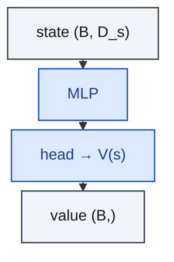

# ValueNetwork

> Estimates V(s) — the expected return from a state under the current policy.

**Shapes:** `s:(B, D_s) → V:(B,)`

**Used in**

- Critic in every actor-critic algorithm (A2C, A3C, PPO, SAC)
- Baseline for variance reduction in policy gradients
- Bootstrap target for n-step / TD(λ) returns
- Generalised Advantage Estimation (GAE)

**Tasks**

- Reducing gradient variance in REINFORCE / PG methods
- Computing advantages `A(s, a) = Q(s, a) − V(s)`
- On-policy bootstrapping where Q(s, a) is impractical (continuous action spaces)

**Common pitfalls**

- Bootstrapping with the same network used for updates causes instability — use a slowly-tracking TargetNetwork for the target.
- Tightly coupling actor and critic learning rates often destabilises both; tune them independently.
- MSE loss against high-variance returns can over-fit; clip the value loss (PPO) or use Huber loss (DQN family).

**See also**

- [Temporal-difference learning (Sutton 1988)](https://link.springer.com/article/10.1007/BF00115009)
- [GAE (Schulman et al. 2015)](https://arxiv.org/abs/1506.02438)
- [PPO value-function clipping](https://arxiv.org/abs/1707.06347)
