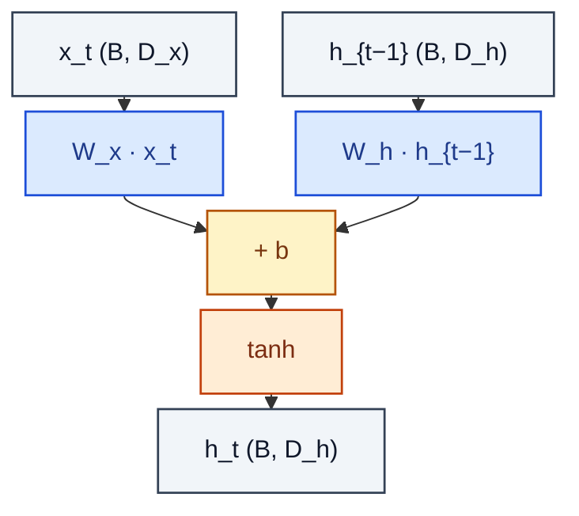

# RNNCell

> Vanilla recurrent cell: h_t = tanh(W_x x_t + W_h h_{t-1} + b).

**Shapes:** `x_t:(B, D_x), h_{t-1}:(B, D_h) → h_t:(B, D_h)`

**Used in**

- Early language models and sequence taggers (pre-LSTM era)
- Hopfield-style associative memories (modernised in Ramsauer et al. 2020)
- Toy / teaching examples illustrating vanishing-gradient

**Tasks**

- Sequence modelling when sequences are very short and overhead matters
- Foundational analysis of recurrence and dynamical systems

**Common pitfalls**

- Vanishing / exploding gradients with sequences > ~20 steps — almost never used in modern code.
- Stacking deep RNNs without orthogonal init or gradient clipping is unstable.
- Replaced in nearly all practical use by LSTM, GRU, Transformer, or SSMs.

**See also**

- [Elman RNN (Elman 1990)](https://onlinelibrary.wiley.com/doi/10.1207/s15516709cog1402_1)
- [On the difficulty of training RNNs (Pascanu et al. 2013)](https://arxiv.org/abs/1211.5063)
