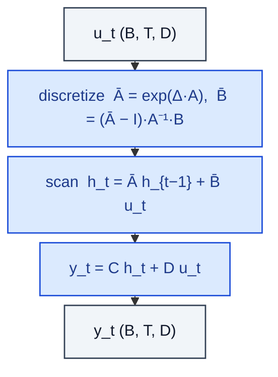

# StateSpaceModel

> Linear SSM with discretized A, B and an output mapping y = C h + D u.

**Shapes:** `u:(B, T, D) → y:(B, T, D)`

**Used in**

- S4 (Gu et al. 2021) — first SSM to beat Transformers on Long Range Arena
- S5, H3, Hyena — variants exploring kernels and gating
- Backbone for Mamba's selective SSM

**Tasks**

- Very long-range sequence modelling (Path-X, audio, DNA)
- Tasks where memory must remain constant w.r.t. sequence length at inference

**Common pitfalls**

- HiPPO initialisation of A is critical — random init is far worse.
- Numerical stability of the discretisation (ZOH vs bilinear) affects training.
- Linear SSMs lack content-based gating — outperformed by Mamba on language tasks.
- FFT-based parallel scan is fast for inference but needs careful padding.

**See also**

- [S4 / HiPPO (Gu et al. 2021)](https://arxiv.org/abs/2111.00396)
- [S5 (Smith et al. 2022)](https://arxiv.org/abs/2208.04933)
- [H3 (Fu et al. 2022)](https://arxiv.org/abs/2212.14052)
