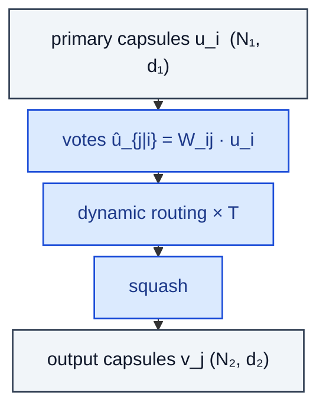

# CapsuleLayer

> Capsule routing layer (Sabour et al.): predict votes, dynamic routing-by-agreement, squash.

**Shapes:** `primary caps → output caps`

**Used in**

- Dynamic Routing Between Capsules (Sabour, Frosst, Hinton 2017)
- Matrix Capsules with EM Routing (Hinton et al. 2018)
- Stacked Capsule Autoencoders

**Tasks**

- Part-whole hierarchy modelling — argued to be a more 'biologically plausible' alternative to CNNs
- Pose / orientation reasoning where vectors carry geometric info

**Common pitfalls**

- Dynamic routing is expensive and hard to scale beyond small images (MNIST / CIFAR).
- Largely supplanted by self-attention in modern vision — capsules saw limited adoption.
- Routing iterations T must be small (3) to be tractable; too few and routing under-trains.

**See also**

- [Dynamic Routing Between Capsules (Sabour et al. 2017)](https://arxiv.org/abs/1710.09829)
- [Matrix Capsules with EM Routing (Hinton et al. 2018)](https://openreview.net/forum?id=HJWLfGWRb)
