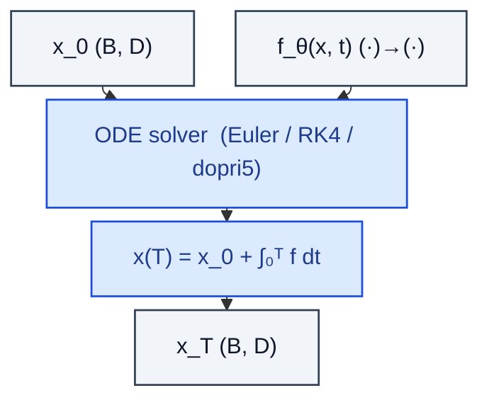

# NeuralODE

> Treat depth as continuous time and integrate dx/dt = f_θ(x, t).

**Shapes:** `x_0 → x_T`

**Used in**

- Neural ODE (Chen et al. 2018) — original paper, NeurIPS best paper
- FFJORD — continuous normalising flows
- Latent ODEs for irregular time series
- Flow-matching / rectified-flow diffusion (probability-flow ODE view)

**Tasks**

- Continuous-depth networks where memory scales with the adjoint, not the network depth
- Modelling irregular time-series (medical, finance) at arbitrary sample times
- Generative modelling via instantaneous change of variables

**Common pitfalls**

- Adjoint method saves memory but is numerically unstable — checkpointing the forward trajectory is often more reliable.
- Adaptive solvers (dopri5) can stall on stiff dynamics — bound max_steps.
- Wall-clock per step is far higher than discrete networks at equal expressivity.

**See also**

- [Neural ODE (Chen et al. 2018)](https://arxiv.org/abs/1806.07366)
- [FFJORD (Grathwohl et al. 2018)](https://arxiv.org/abs/1810.01367)
- [Latent ODEs (Rubanova et al. 2019)](https://arxiv.org/abs/1907.03907)
