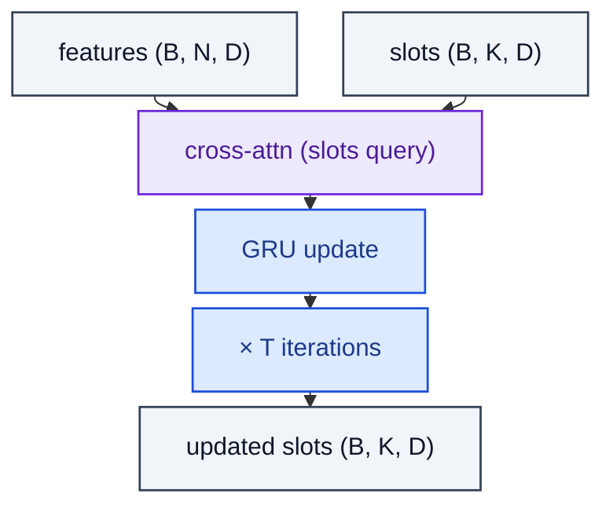

# SlotAttention

> Iterated cross-attention from a small set of slots into per-pixel features (SlotAttention).

**Shapes:** `feats:(B, N, D), slots:(B, K, D) → slots`

**Used in**

- Slot Attention (Locatello et al. 2020)
- OSRT / SAVi for video object discovery
- Object-centric world models in RL

**Tasks**

- Unsupervised object discovery / instance segmentation
- Compositional scene representations from images / videos

**Common pitfalls**

- Number of slots K is a strong inductive bias — fewer than objects merges, more leaves slots empty.
- Slot symmetry-breaking is induced by random init each forward — beware deterministic fixes that collapse all slots.
- Softmax over slots (competition) is essential — without it, all slots converge to the same content.
- Works on small / synthetic scenes; transfer to realistic images is an active research area.

**See also**

- [Slot Attention (Locatello et al. 2020)](https://arxiv.org/abs/2006.15055)
- [SAVi (Kipf et al. 2021)](https://arxiv.org/abs/2111.12594)
