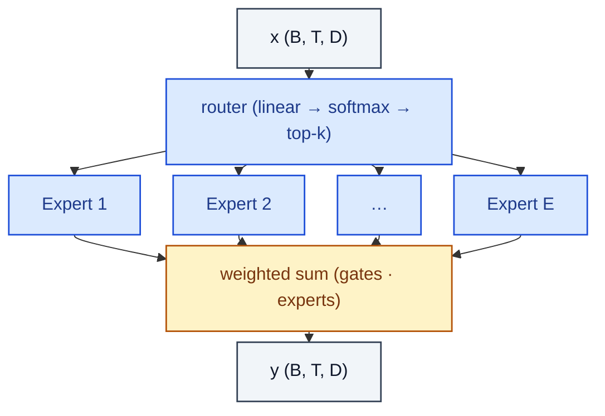

# MixtureOfExperts

> Top-k gated mixture: router scores experts, top-k run, weighted sum.

**Shapes:** `(B, T, D) → (B, T, D)`

**Used in**

- GShard, Switch Transformer — large-scale Google LMs
- Mixtral 8×7B, Mixtral 8×22B, DeepSeek-V2/V3 — open MoE LLMs
- GLaM, ST-MoE for translation and language modelling

**Tasks**

- Scaling parameter count without scaling per-token FLOPs
- Multi-domain / multi-task models where experts can specialise

**Common pitfalls**

- Load imbalance — most tokens route to few experts unless an auxiliary load-balancing loss is added (Switch Transformer §3.2).
- Top-k > 1 doubles FLOPs but tames training instability vs top-1.
- Expert parallelism complicates training — needs all-to-all communication and careful pipeline overlap.
- Inference batching is harder — pads or drops tokens at expert capacity limits.

**See also**

- [Sparsely-Gated MoE (Shazeer et al. 2017)](https://arxiv.org/abs/1701.06538)
- [GShard (Lepikhin et al. 2020)](https://arxiv.org/abs/2006.16668)
- [ST-MoE (Zoph et al. 2022)](https://arxiv.org/abs/2202.08906)
- [Mixtral of Experts (Jiang et al. 2024)](https://arxiv.org/abs/2401.04088)
