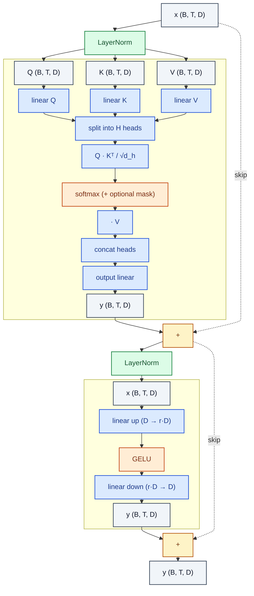

# TransformerEncoderBlock

> Pre-norm transformer block: LN → MHA → +; LN → FFN → +.

**Shapes:** `(B, T, D) → (B, T, D)`

**Used in**

- BERT, RoBERTa, DeBERTa — masked-LM pre-training
- ViT, DeiT, BEiT — image classification
- Whisper encoder, wav2vec 2.0 — speech

**Tasks**

- Bidirectional representation learning
- Sequence-level / token-level classification, regression, retrieval

**Common pitfalls**

- Post-norm (original Vaswani) is unstable at depth — Pre-norm is the modern default.
- Skip-connection scaling: at extreme depth (>100 layers) consider DeepNet or ReZero to control variance growth.
- Each block has TWO residual sums — implementations sometimes forget one and 'work' with degraded quality.

**See also**

- [Pre-norm Transformer (Xiong et al. 2020)](https://arxiv.org/abs/2002.04745)
- [BERT (Devlin et al. 2018)](https://arxiv.org/abs/1810.04805)
- [DeepNet (Wang et al. 2022)](https://arxiv.org/abs/2203.00555)
